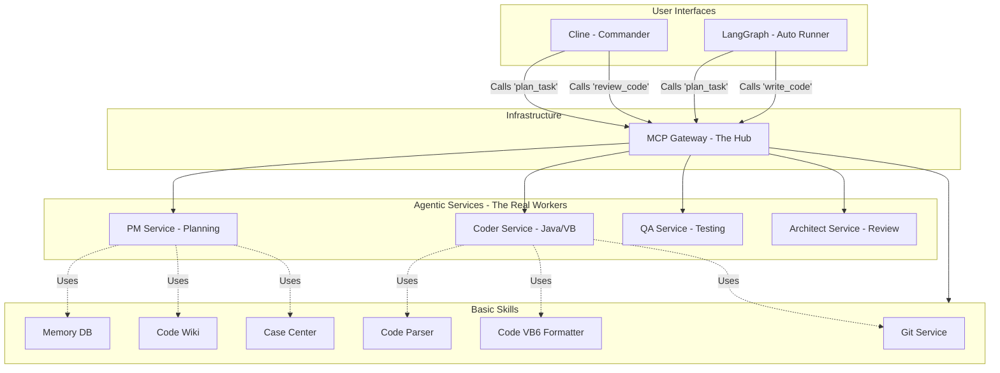
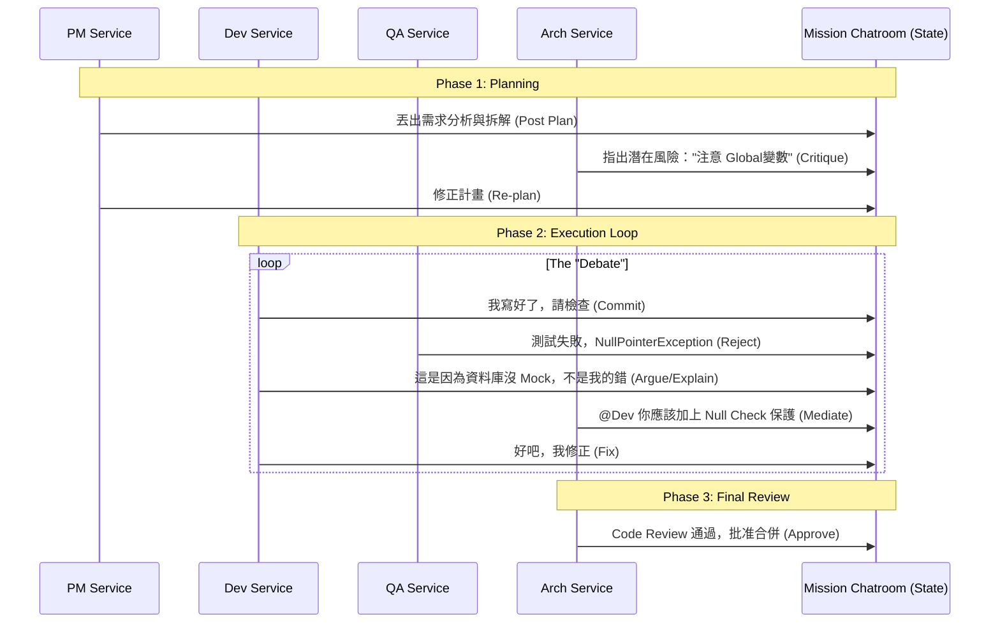

# 自研 AI 智能體 (Custom Agent) 系統架構設計

## 1. 設計哲學：Stateful Autonomous Agent
有別於 Cline 的「一問一答」，這個自研 Agent 是一個 **狀態機 (State Machine)**。它擁有長期記憶，能夠在任務失敗時自我修正，直到目標達成。

我們採用 **LangGraph** 作為核心框架，因為它最適合處理這種 "Cyclic Graph" (循環圖) 的流程。

---

## 2. 系統架構圖 (System Architecture - Unified Model)

**修正**: 為了消除矛盾，我們將 PM、Dev、QA 的核心能力下沉為 **MCP Services**。
這樣一來，Clines 可以呼叫它們，LangGraph 也可以呼叫它們。

*   **LangGraph** 變成了一個純粹的 **"排程器 (Scheduler)"**，負責把這些 MP Services 串起來。
*   **MCP Gateway** 成為所有能力的唯一入口。



> **重點**: 
> *   **PM 不再只是 LangGraph 裡的一個 Function**，它是一個獨立的 **MCP Server** (`pm_service`)。
> *   Cline 呼叫 `pm_service.plan()` 來獲取計畫。
> *   LangGraph 呼叫 `pm_service.plan()` 也是做一樣的事。
> *   **一致性達成**：無論是手動 (Cline) 還是自動 (LangGraph)，用的都是同一顆大腦。

---

## 3. 核心互動模式：虛擬會議室 (The Virtual Meeting Room)

為了打破線性的無聊感，我們採用 **"黑板模式 (Blackboard Pattern)"** 或 **"聊天室模式"**。
所有 Agent 不再是「接力棒傳遞」，而是**圍坐在圓桌會議室**裡討論。

### 互動流程圖 (The Collaboration Loop)



### 為什麼這不無聊？ (Rich Interaction)
1.  **共享上下文 (Shared Context)**:
    *   所有 Agent 都能讀取 `Mission Chatroom` 的歷史訊息。
    *   Dev 在寫 Code 時，**看得到** 架構師剛剛對 PM 說的警告：「小心記憶體洩漏」。這會影響 Dev 的決策。
    
2.  **動態辯論 (Dynamic Debate)**:
    *   **QA 不只是報錯**：QA 可以說「這個測試沒過，而且我覺得你的實作邏輯跟 PM 說的不一樣」。
    *   **Dev 可以反駁**：Dev 可以回「那是因為測試資料不完整」，並請求 PM 釐清。
    *   **Arch 可以仲裁**：當 Dev 和 QA 僵持不下，Architect 會跳出來做技術裁決。

3.  **實作方式 (LangGraph Implementation)**:
    *   State 不再只是變數，而是一串 `List[Message]`。
    *   每個 Node (Service) 的輸入是 `messages`，輸出也是 `message`。
    *   這讓整個過程看起來就像是一個 **真實的 Slack Channel**。

---

## 4. 詳細組件設計 (Component Design via MCP)

現在，LangGraph 裡的每一個 Node 變得非常輕量，它主要負責 **"呼叫對應的 MCP Service"** 並處理回傳狀態。

### A. 監視器 (The Watchdog)
*   **動作**: 呼叫 `Gateway.git.list_issues()`。

### B. 規劃者 (PM Node) -> 呼叫 `PM_Service`
*   LangGraph 節點內容：
    ```python
    def pm_node(state):
        # 將思考外包給 PM Service MCP
        plan = mcp_client.call_tool("pm_service", "create_plan", {"issue": state["issue"]})
        return {"plan": plan}
    ```
*   **PM Service (MCP) 內部**: 運行 GPT-4o 模型，分析需求，回傳 JSON Plan。

### C. 執行者 (Developer Node) -> 呼叫 `Dev_Service`
*   LangGraph 節點內容：
    ```python
    def dev_node(state):
        # 將 coding 外包給 Dev Service MCP
        result = mcp_client.call_tool("dev_service", "implement_task", {"task": state["current_task"]})
        return {"code_status": result.status}
    ```
*   **Dev Service (MCP) 內部**: 運行 Claude 3.5 Sonnet，執行 `Checkout`, `Read`, `Think`, `Write` 的微觀循環。

### D. 測試者 (QA Node) -> 呼叫 `QA_Service`
*   **動作**: 呼叫 `QA_Service.run_tests()`。
*   **QA Service (MCP) 內部**: 自動生成 JUnit，執行 Maven Test，回傳 Report。

### E. 把關者 (Architect Node) -> 呼叫 `Arch_Service`
*   **動作**: 呼叫 `Arch_Service.review_pr()`。
*   **Arch Service (MCP) 內部**: 讀取 Diff，用 o1 模型進行深度審查，回傳 Approve/Reject 建議。

---

這樣設計的巨大優勢：**邏輯復用 (Logic Reuse)**。
*   當您在 Cline 裡手動喊：「幫我 Review 這段 code！」Cline 也是呼叫 `Arch_Service.review_pr()`。
*   當半夜自動化腳本跑到 Review 步驟時，也是呼叫 `Arch_Service.review_pr()`。
*   **結果保證一致**。不會發生「Cline 覺得可以，但自動化腳本覺得不行」的狀況。

---

## 5. 技術實作關鍵 (Technical Key Points)

1.  **Graph State (Context)**:
    *   在 LangGraph 中，這是一份全域的 State Object：
    ```python
    class AgentState(TypedDict):
        issue_id: str
        requirements: str
        plan: List[Task]
        current_file: str
        test_results: str
        review_comments: List[str]
        retry_count: int
    ```
    *   藉由這個 State，Developer 可以看到 QA 剛剛跑出來的錯誤訊息，實現跨角色溝通。

2.  **Human-in-the-loop (人工介入)**:
    *   LangGraph 支援 "Interrupt"。
    *   我們可以在 `Review` 節點設定中斷點。Agent 跑到這裡會**暫停**，發送訊息給用人類 (透過 Slack/Discord/Cline)，等人類按 "Approve" 才真的發 PR。

---

這份設計確保了 Agent 不只是一個「寫 code 的腳本」，而是一個**具備自我修正能力的系統**。它會嘗試修復錯誤，直到無法解決才呼叫人類。
