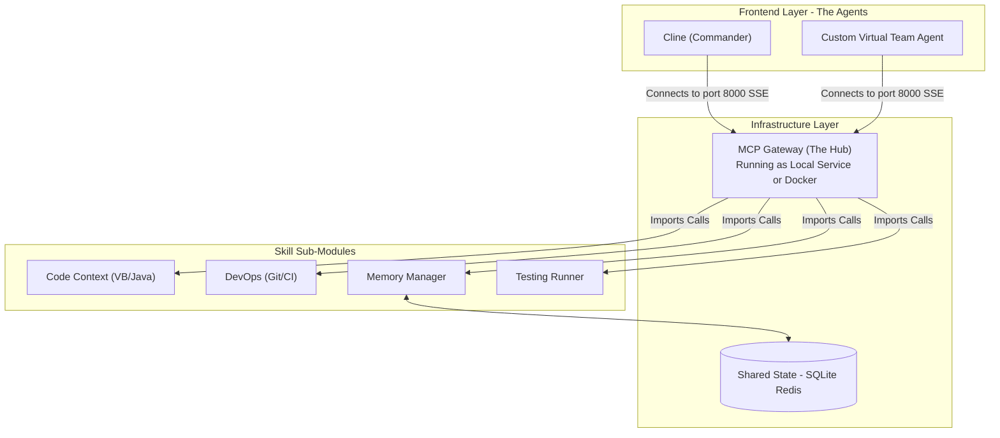

# 多角色 AI 虛擬開發團隊架構提案 v4

## 核心願景 (Vision)
打造一個 **"強大的虛擬軟體開發團隊"**，讓老闆與團隊成員感受到不僅僅是工具，而是有 PM、架構師、工程師、測試員在 24/7 協作。
核心策略：**雙 Agent 並行 (Dual-Agent System)** —— 結合現有的 **Cline** (互動式開發) 與 **自研虛擬團隊** (背景自動化開發)，兩者透過統一的 **MCP (Model Context Protocol)** 共享技能與知識，避免綁死在單一 Agent 平台。

## 支援技術堆疊
-   **Legacy**: VB6
-   **Modernized**: VB.NET, Java
-   **Infrastructure**: MCP, Docker, CI/CD

## 1. 架構設計：共享 MCP 層與 Gateway (The Shared Skill Layer)

### A. 為什麼需要 Gateway?
在標準 MCP 架構中，Client (Cline) 通常直接連接到 Server。但當我們有多組工具 (Git, Parser, Memory) 時，如果讓 User 設定 4~5 個連線會很繁瑣。
**MCP Gateway** 是一個設計模式（Aggregator Pattern），它將多個子工具整合為**單一入口點 (Single Entrypoint)**。

### B. 架構圖


### C. 實作細節 (Technical Implementation)
### C. 實作細節 (Technical Implementation)
1.  **連線方式 (SSE vs Stdio)**:
    *   **Stdio (標準輸入輸出)**: 預設模式，Client 啟動 Server process。缺點是每次啟動都是獨立實例，**無法共享記憶體**。
    *   **SSE (Server-Sent Events) over HTTP**: **強烈建議採用**。我們將 Gateway 跑成一個 Web Service (e.g., `localhost:8000`)。
    *   **Client 設定**: 在 Cline 中只需設定**一組**：
        ```json
        {
          "mcpServers": {
            "virtual-team-gateway": {
              "command": "python",
              "args": ["-m", "gateway_server"],
              "url": "http://localhost:8000/sse" 
            }
          }
### D. 多人開發與協作策略 (Multi-Developer Strategy)
**User 疑問**: "全部塞在一個 Gateway 裡，多人開發會不會打架？"
**解決方案**: 採用 **微服務/模組化架構 (Micro-Services / Plugins)**。Gateway 只是一個**很薄的路由器 (Thin Router)**。

1.  **開發分工模式**:
    *   **Developer A**: 負責開發 `mcp-vb6-parser` (獨立 Repo 或獨立資料夾)。
    *   **Developer B**: 負責開發 `mcp-git-ops` (獨立 Repo)。
    *   **Gateway Maintainer**: 負責維護 `gateway-config.yaml`，把 A 和 B 的服務串起來。

2.  **技術深度剖析：這不是胡說八道，這是 "MCP Proxy Pattern"**
    *   **誠實說明**: 您是對的，MCP 協定規格書（Specification）裡面**確實沒有**定義一個叫做 `Gateway` 的東西。這是軟體架構模式，不是協定原生功能。
    *   **真正發生的事 (The Engineering Reality)**:
        我們正在構建的是一個 **"MCP 代理伺服器 (MCP Proxy Server)"**。它的原理跟 Nginx 反向代理完全一樣，只是它代理的不是 HTTP，而是 **JSON-RPC** 訊息。

    *   **詳細互動流程 (Step-by-Step Flow)**:
        1.  **連線建立**: 
            *   Cline 連上我們的 Server。此時在 Cline 眼中，**我們就是 Server**。
        
        2.  **請求轉發 (The Proxy Logic)**:
            *   **Step A**: Cline 發送 `{"jsonrpc": "2.0", "method": "tools/list", "id": 1}` 給我們。
            *   **Step B (我們的程式碼)**: 
                *   收到請求，發現是查詢工具。
                *   我們內部有兩個連線 (Clients) 分別連到 `vb-service` 和 `git-service`。
                *   我們**假裝成 Client**，分別向這兩個服務發送 `tools/list`。
            *   **Step C**: 
                *   `vb-service` 回傳 `[{name: "parse_vb6"}]`。
                *   `git-service` 回傳 `[{name: "git_commit"}]`。
            *   **Step D (合併與記錄路由)**: 
                *   我們的程式將這兩個陣列合併：`[{name: "parse_vb6"}, {name: "git_commit"}]`。
                *   **關鍵動作 (Routing Table)**: 同時，Gateway 會在記憶體中建立一張表：
                    *   `"parse_vb6"` -> 屬於 `vb-service`
                    *   `"git_commit"` -> 屬於 `git-service`
            *   **Step E (回傳/偽裝)**: 
                *   我們將合併後的結果回傳給 Cline。
                *   **關鍵點 (The Masquerade)**: Gateway 會告訴 Cline：**「我有兩個工具，叫做 `parse_vb6` 和 `git_commit`。」**
                *   **Cline 的認知**: Cline 收到回應後，會認為 **「Gateway 這個 Server 擁有 `parse_vb6` 這個技能」**。Cline 完全不知道背後有 `vb-service` 的存在。

        3.  **執行轉發 (Execution Routing)**:
            *   **Cline 呼叫**: 因為 Cline 相信 Gateway 有這個工具，所以當 User 問「解析這段 code」時，Cline 會向 Gateway 發送：`call "parse_vb6"`。
            *   **Gateway 判斷**: Gateway 收到請求，查表發現 `parse_vb6` 其實是 `vb-service` 的。
            *   **轉發**: Gateway 將請求原封不動轉發給 `vb-service`。
            *   **結論**: 這不矛盾。Cline 知道有 `parse_vb6`，是因為 **Gateway 在握手階段騙了它 (或者說，代理了它)**。
        
    *   **結論**:
        *   這在技術上完全可行，因為 MCP 的基礎是 **JSON-RPC**。只要我們能解析、轉發、合併 JSON 物件，就能實現這個中間層。
        *   這不是魔法，這就是單純的 **API Aggregation (API 聚合)** 實作。

3.  **好處**:
    *   **語言無關**: VB6 解析器可以用 Python 寫，Git 工具可以用 Node.js 寫，Gateway 照樣能整合。
    *   **獨立部署**: 當 Developer A 更新了 VB6 Parser，他只需要重新部署 `vb-server`，不影響其他人。
    *   **隔離錯誤**: 如果 VB6 Parser 崩潰了，Git 功能仍然正常運作。
2.  **關鍵原理：動態工具發現 (Dynamic Tool Discovery via `tools/list`)**
    *   **User 疑問**: "Cline 怎麼知道 Gateway 裡有哪些工具？是看 Config 嗎？"
    *   **技術事實**:
        *   **不是看 Config**: `config.json` 只負責定義「如何連線」(Connection Transport)。
        *   **是動態詢問**: MCP 協定規範中，Client (Cline) 連上 Server 後，**一定會主動發送** JSON-RPC 請求 `tools/list`。這是標準握手流程的一部分。
    *   **Gateway 的角色 (Smart Proxy)**:
        *   我們需要編寫 Gateway 的程式碼 (Python/TypeScript) 來實作這個邏輯。
        *   當 Gateway 收到 Cline 的 `tools/list` 請求時，它會充當 **代理人 (Proxy)**：
            1.  Gateway 轉身向後端的 Sub-Modules (Git, Parser...) 發出 `tools/list`。
            2.  Gateway 收集所有回應，將它們 **合併 (Merge)** 成一個超大清單。
            3.  Gateway 回傳給 Cline。
    *   **結論**: Cline 看到的只是一個標準的 MCP Server 回傳了一份合法的工具清單，它並不知道這些工具是聚合來的。這完全符合 MCP 標準協定。

3.  **狀態共享**:
    *   Gateway 啟動時會連接到 SQLite/Redis。
    *   當 Cline 寫入 Memory ("User 希望重構 modAuth")，資料存入 SQLite。
    *   背景 Agent 醒來查詢 Memory，能讀到同一份資料，實現無縫協作。

## 2. 虛擬團隊角色設計 (The Virtual Squad)

為了展現 "強大團隊" 的感覺，我們需要在主控台或 Log 中明確展現角色的互動。

| 角色 (Persona) | 框架建議 | 職責與互動 |
| :--- | :--- | :--- |
| **Product Owner (PO)** | CrewAI Manager / LangGraph Root | 監控 GitHub Issues，決定優先級，指派任務給 Dev。會發出像是 " @Dev 可以在週五前修好這個 VB.NET 的 Bug 嗎？" 的指令。 |
| **Tech Lead (Architect)** | OpenAI o1 / o3-mini | 負責 Code Review (Auto-PR Reviewer)。當 Cline 提交程式碼後，Tech Lead 會在 PR 留言："這裡不符合我們的 Clean Architecture，請修正"。 |
| **Sr. Developer (Java/NET)** | Claude 3.5 Sonnet | 負責具體的 Refactoring 任務。可以 24/7 運作，處理從 VB6 轉換到 Java 的繁瑣工作。 |
| **QA Engineer** | GPT-4o / Browser Tool | 負責寫 BDD 測試案例，並在 CI 失敗時自動回報 Log 分析。 |

## 3. 整合實作細節：雙 Agent 如何運用 MCP (Integration & Usage Scenarios)

### A. Cline 高階指揮模式 (Interactive Commander Mode)
**修正觀點**: 我們不將 Cline 視為單純的 Chatbot，而是將其視為虛擬團隊的 **"指揮官介面" (Mission Control)**。

*   **核心機制: Delegation via MCP (委派模式)**
    *   Cline 透過 MCP 連接到 `Team-Orchestrator` (透過 Gateway)。
    *   應用場景：**User**: "這個 `modInvoicing` 模組太舊了，幫我安排遷移到 Java，我要下週驗收。"
    *   **Cline (Commander)**: *呼叫 MCP Tool `team_manager.dispatch_mission(target='modInvoicing')`*。
    *   **System Feedback**: (Cline 顯示) `[Mission ID: #992] Started. PM Agent is breaking down tasks...`

### B. 客製化 Agent 情境 (Background Autonomous Mode)
自研 Agent (Virtual Team) 是**長期運行、目標導向的**，它就像一個不需要睡覺的員工。

*   **配置方式**:
    *   使用 **LangGraph** 定義狀態機 (State Machine)。
    *   Agent 程式碼中透過 MCP Client 連接 `localhost:8000` (Gateway)。
*   **應用場景 (Scenario) - "24/7 自動重構與遷移"**:
    1.  **Dev Agent**: 呼叫 MCP `git.checkout` -> `vb_parser.parse` -> `fs.write_file`。
    2.  **Architect Agent**: 偵測到 Push，執行 Review，若發現問題則 Reject。

## 4. 技術選型評估

| 框架 | 適合場景 | 優點 | 缺點 | 建議 |
| :--- | :--- | :--- | :--- | :--- |
| **LangGraph** (Python) | 複雜狀態機、精細控制 | 流程控制最強，適合定義 "Dev -> Review -> Fix" 的嚴謹循環。 | 學習曲線較高，需要寫較多 Code。 | **首選 (高可控性)** |
| **CrewAI** (Python) | 角色扮演、團隊模擬 | 非常適合想要 "Rich Role-Playing" 的場景，易於定義 Persona，適合展示給老闆看。 | 流程控制較弱 (容易跑偏)，但在 "感覺像個團隊" 這點做得最好。 | **次選 (展示效果好)** |

**混合建議**: 使用 **LangGraph** 作為底層狀態機 (確保事情做對)，但使用 **CrewAI** 來定義 Prompt 與 Persona (確保看起來像團隊)，兩者都透過 **MCP** 操作實際資產。

## User Review Required
-   [ ] 確認是否同意主要使用 Python (LangGraph/CrewAI) 作為自研 Agent 的基底？(因 MCP SDK Python 支援完善且生態豐富)
-   [ ] 確認選擇 SSE (HTTP) 模式作為 Gateway 實作方式？(需要 Docker 或背景 Service 支援，但能實現真正的雙 Agent 協作)
