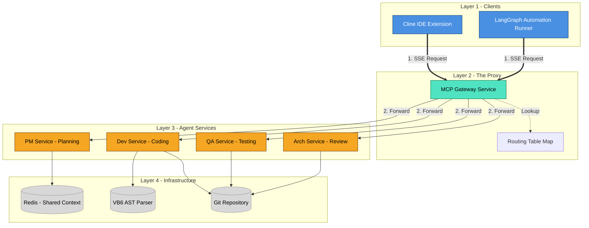

# 技術設計規格書：雙 Agent MCP 協作架構
## Technical Design Specification: Dual-Agent MCP Architecture

**文件目的**: 供 Technical Design Review 會議使用，定義系統邊界、通訊協定、狀態管理與錯誤處理機制。

---

## 1. 架構總覽 (System Architecture - C4 Level 2)

本系統採用 **微服務化 Agent (Agent-as-a-Service)** 架構，透過 **MCP Gateway** 實現統一接入與資源隔離。

### 1.1 核心設計模式 (Design Patterns)
1.  **Facade Pattern (Gateway)**: Gateway 作為唯一入口，遮蔽後端多個 MCP Service 的複雜性。
2.  **Proxy Pattern (Tool Routing)**: Gateway 不執行工具邏輯，僅負責 JSON-RPC 請求的 `Unmarshalling` -> `Routing` -> `Forwarding`。
3.  **Blackboard Pattern (Collaboration)**: 透過共享的 LangGraph State (Checkpointer)，實現多 Agent 間的非同步訊息交換。

### 1.2 容器圖 (Container Diagram - Polished)

我們使用標準 C4 模型配色進行繪製：
*   **深藍 (Person)**: 用戶端角色 (Cline / Runner)
*   **亮藍 (Container)**: 核心服務 (Gateway, MCP Services)
*   **灰色 (Database/Infra)**: 基礎設施



---

## 2. 通訊協定細節 (Protocol & Interface)

### 2.1 JSON-RPC 請求聚合與轉發邏輯
Gateway 實作了 **Request Interception & Aggregation** 機制。

#### A. `tools/list` (Handshake Phase)
當 Client 發起 `tools/list` 時，Gateway 執行 **Scatter-Gather**：
1.  **Scatter**: 平行發送 `tools/list` 給下游所有 Service (PM, Dev, QA)。
2.  **Gather**: 收集所有回傳的 `Tool[]` 陣列。
3.  **Namespace Injection (Optional)**: 為避免名稱衝突，Gateway 可自動為工具加上前綴 (例如 `pm_planTask`)，並更新 Routing Table。
4.  **Response**: 回傳聚合後的 `Tool[]` 給 Client。

#### B. `tools/call` (Execution Phase)
1.  **Intercept**: 攔截 `tools/call` 請求。
2.  **Route**: 根據 `tool_name` 查詢 Routing Table，取得目標 `Transport`。
3.  **Forward**: 將 Payload 原封不動 (Pass-through) 轉發給目標 Service。
4.  **Stream**: 若工具支援 Progress Token，Gateway 需透傳 Progress Notification。

### 2.2 狀態管理 (LangGraph State Schema)
自動化流程的狀態定義如下，確保 Type Safety 與資料一致性。

```python
class AgentState(TypedDict):
    # 任務上下文
    task_id: str
    requirements: str
    
    # 協作黑板 (Virtual Meeting Room)
    messages: Annotated[List[BaseMessage], add_messages]
    
    # 執行狀態
    current_phase: Literal['plan', 'code', 'test', 'review']
    artifacts: Dict[str, str]  # filename -> file_path
    
    # 錯誤處理
    retry_count: int
    last_error: Optional[str]
    
    # 品質柵欄 (Quality Gate)
    review_comments: List[str]
    is_approved: bool
```

---

### 2.3 協定決策：為什麼選擇 MCP 而非 A2A Protocol？
**Protocol Decision Record (ADR)**

*   **評估背景**: 使用者詢問是否應採用新興的 **A2A (Agent2Agent) Protocol**。
*   **決策**: 本階段 (POC) 繼續使用 **MCP**，暫不引入 A2A。
*   **理由**:
    1.  **相容性 (Compatibility)**: Cline 目前原生僅支援 MCP Client。若使用 A2A，需在 Cline 側開發額外的 Adapter。
    2.  **複雜度 (Complexity)**: A2A 強調「Agent Identity (AgentCards)」與「複雜握手」，對於內部封閉系統 (Internal System) 而言過於厚重。
    3.  **架構一致性**: 我們的 Gateway 其實已經實作了 A2A 的核心精神（服務聚合與路由）。且因為 A2A 與 MCP 底層皆為 **JSON-RPC 2.0**，未來若有需要，將 Gateway 升級為標準 A2A Node 成本極低。

> **結論**: 把 "Custom Agent" 包裝成 "MCP Tools" 是讓 Cline 能立即指揮它的最快路徑。

---

## 3. 關鍵模組實作規格 (Component Specs)

### 3.1 PM Service (Planning Engine)
*   **Input**: `requirements` (String)
*   **Process**: 
    1.  Invoke LLM (Model: Claude 3.5 Sonnet / GPT-4o).
    2.  Use Tool: `vb_parser.analyze_dependencies(module_name)`.
    3.  Generate Strategy: Chain-of-Thought reasoning for migration steps.
*   **Output**: `InitializationPlan` (JSON Schema Validated).

### 3.2 Dev Service (Translation Engine)
*   **Input**: `task_item` (String), `source_file` (Path)
*   **Process**:
    1.  Use Tool: `fs.read_file()`.
    2.  Use Tool: `rag.search_knowledge(query="VB6 FileOpen replacement")`.
    3.  Generate Code.
    4.  Use Tool: `linter.validate_java_syntax()`.
*   **Output**: `CommitDiff` (String).

### 3.3 Gateway (The Router)
*   **Language**: Python 3.10+ (Asyncio)
*   **Dependencies**: `mcp-sdk`, `fastapi` (for SSE endpoint), `uvicorn`.
*   **Concurrency**: 使用 `asyncio.gather` 處理平行的子服務請求，避免 Head-of-Line Blocking。

---

## 4. 異常處理與容錯 (Error Handling & Resilience)

1.  **Service Isolation**: 
    *   若 `QA Service` 崩潰 (Crash)，Gateway 應捕捉 `ConnectionError`，並從 `tools/list` 中動態移除該服務，或回傳明確的 `JSON-RPC Error Code -32603 (Internal Error)`，避免整條連線中斷。
2.  **Timeout Strategy**:
    *   Gateway 對後端轉發設定 `30s` Timeout (可配置)。
    *   若超時，回傳 `Timeout` 錯誤給 Client，Client 可選擇重試。
3.  **State Persistence**:
    *   LangGraph 狀態每次 State Transition 皆寫入 **SqliteCheckpointer**。
    *   若 Runner 當機，重啟後可讀取 DB 恢復最後一次的 State，保證 **Exactly-Once Processing**。

---

## 5. 安全性考量 (Security Constraints)

1.  **Localhost Binding**: Gateway 預設僅監聽 `127.0.0.1`，防止外部網路存取。
2.  **File System Sandbox**: 
    *   `Dev Service` 的 `fs` 工具應限制在專案根目錄 (Root Dir) 下，禁止 `../` 向上遍歷。
3.  **Command Whitelist**: `run_command` 工具僅允許白名單內的指令 (e.g., `mvn`, `git`, `javac`)，禁止 `rm -rf`。
